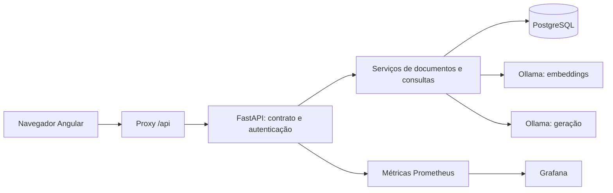
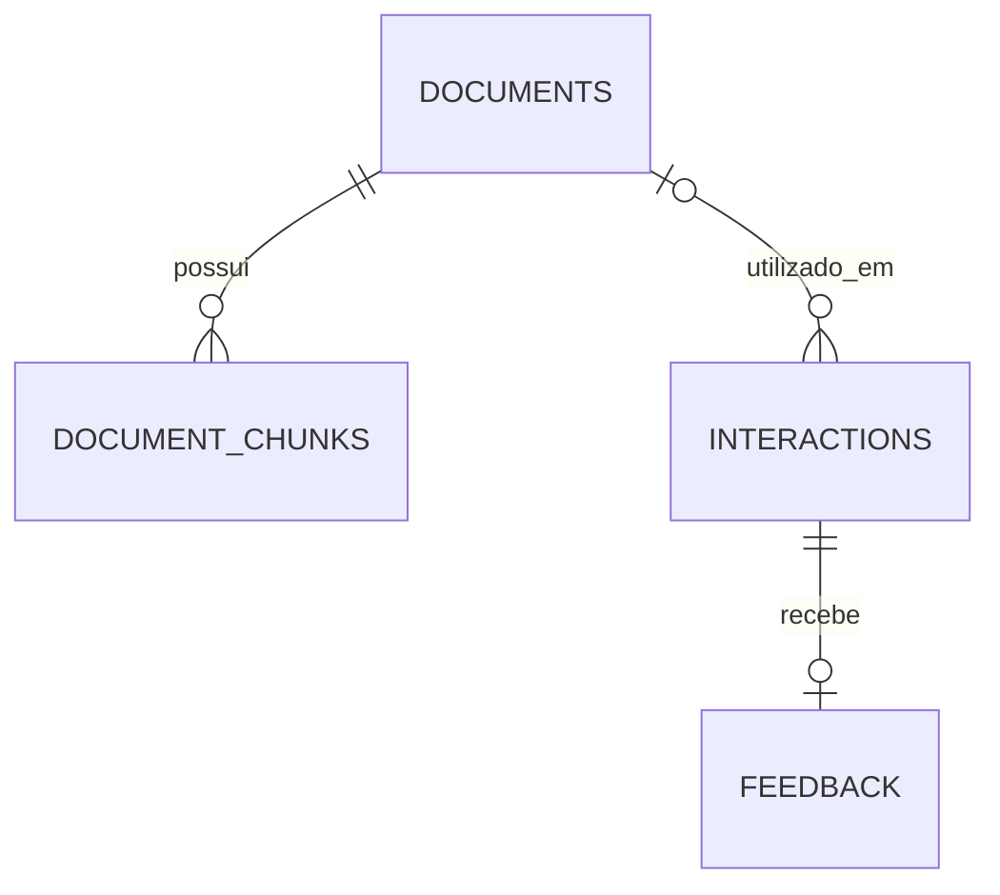

# Documento — guia da aplicação

## 1. Objetivo e experiência de uso

As funcionalidades de produto, novos endpoints, configuração de OCR/worker e políticas estão detalhados no [guia de evolução](EVOLUCAO.md).

Documento é uma aplicação para consultar arquivos com apoio de inteligência artificial. O usuário envia um arquivo, faz uma pergunta, recebe uma resposta e pode avaliar sua utilidade. Os arquivos ficam em uma biblioteca; as consultas ficam em um histórico com resposta completa, fontes, modelo e tempo de processamento. A página de estatísticas resume o uso e os feedbacks do workspace.

A interface inicia conversas com memória por padrão. Perguntas de continuação usam o contexto recente do mesmo documento. Desmarque “Manter contexto nesta conversa” antes do primeiro envio para fazer consultas independentes. É possível reutilizar um documento salvo sem transferi-lo novamente do navegador.

Há dois modos:

| Modo | Comportamento | Quando usar |
| --- | --- | --- |
| Documento inteiro | Envia texto ao Ollama até o limite de contexto. PDFs passam por extração local; imagens seguem em base64 e exigem modelo com visão. | Resumos de documentos pequenos e imagens com modelo compatível. |
| Buscar trechos com fontes | Extrai texto, divide em trechos, gera embeddings, recupera os trechos mais próximos da pergunta e os envia ao Ollama. | Perguntas pontuais sobre textos e PDFs com texto extraível. |

A API usa `mode=direct` por padrão. Selecione “Buscar trechos com fontes” ou envie `mode=rag` para ativar a recuperação vetorial. RAG seleciona trechos e pode não cobrir todos os assuntos de um documento.

## 2. Funcionalidades

### Consulta e resposta

- Upload por seleção ou arrastar e soltar, limitado pelo backend e pela configuração exibida na interface.
- Formatos PDF, TXT, MD, CSV, JSON, PNG, JPEG e WEBP. Textos precisam ser UTF-8 e conter conteúdo.
- Perguntas de até 2.000 caracteres, sem aceitar apenas espaços.
- Seleção entre consulta direta e busca por trechos; controle para ignorar o cache.
- Resposta persistida antes de devolver sucesso, com identificador, data, modelo, fontes, modo, latência e tokens informados pelo provedor.
- Feedback positivo ou negativo, com comentário opcional. A avaliação só é aceita uma vez por consulta.
- Respostas e trechos são renderizados como texto. HTML gerado pelo modelo não é executado.

O documento é salvo antes da chamada ao provedor. Se o Ollama falhar, o arquivo continua disponível para uma nova tentativa, mas não é criada uma interação com resposta falsa ou incompleta. Se o banco falhar, a API responde 503; não comunica que a consulta foi salva quando isso não aconteceu.

### Biblioteca

A página Documentos lista arquivos do usuário, permite adicionar arquivos sem consultar, reutilizá-los e excluí-los. O backend detecta duplicatas pelo SHA-256 do conteúdo, dono e MIME. Um mesmo arquivo enviado duas vezes pelo mesmo usuário reutiliza o registro; o primeiro nome é mantido. Usuários diferentes possuem registros independentes.

Excluir um documento remove o arquivo e seus embeddings. As consultas anteriores permanecem no histórico, inclusive os trechos que já foram usados como fontes; sua associação com o documento passa a ser nula. Para remover também esses textos, exclua as consultas correspondentes. A interface explica essa diferença antes da exclusão.

### Histórico e feedback

A listagem é paginada, ordenada por data e UUID para desempate, e apresenta até 200 caracteres de cada resposta. A busca filtra o texto da pergunta. “Ver resposta completa” abre uma página com todo o conteúdo, fontes, avaliação, comentário e metadados.

O limite da listagem reduz o tráfego sem perder a resposta original. A consulta detalhada só carrega o texto completo quando o usuário o solicita. Excluir uma consulta também exclui o feedback correspondente.

### Estatísticas

O painel mostra total de interações, quantidade de avaliações, avaliações positivas/negativas, taxa positiva e latência média geral e das últimas 24 horas. A taxa positiva usa como denominador o total de avaliações, não o total de consultas. Sem avaliações, ela é zero. Cada envio concluído conta como interação, inclusive respostas vindas do cache.

## 3. Arquitetura e responsabilidades



| Camada | Arquivos | Por que existe |
| --- | --- | --- |
| Interface | `frontend/src/app/pages/` | Organiza as telas e seus estados de carregamento/erro. |
| Cliente HTTP | `frontend/src/app/core/api.ts` | Centraliza os contratos, URLs e envio da chave de acesso. |
| Feedback compartilhado | `frontend/src/app/shared/feedback.ts` | Reutiliza validação e comportamento na consulta, no histórico e nos detalhes. |
| Rotas | `app/api/routes/` | Valida o contrato HTTP e traduz resultados/erros em respostas consistentes. |
| Configuração e segurança | `app/core/` | Reúne banco, variáveis, identidade, limites e instrumentação. |
| Orquestração | `app/services/rag_service.py` | Coordena documento, cache, recuperação, geração e persistência. |
| Documentos | `app/services/document_service.py` | Deduplica arquivos e implementa extração, divisão, indexação e recuperação. |
| Provedor | `app/services/ollama_service.py` | Encapsula chamadas REST, timeout e validação das respostas do Ollama. |
| Modelos e schemas | `app/models/`, `app/schemas/` | Separa tabelas do banco dos contratos públicos da API. |
| Evolução do banco | `alembic/` | Aplica mudanças versionadas sem recriar o banco a cada inicialização. |
| Qualidade e operação | `tests/`, `evaluation/`, `monitoring/` | Verifica comportamento, compara respostas de referência e acompanha a aplicação. |

As dependências foram reduzidas às bibliotecas realmente usadas. Redis, Qdrant, LangChain e Streamlit não fazem parte deste fluxo. O PostgreSQL concentra documentos, embeddings e respostas; isso simplifica a instalação e mantém os dados relacionados sob o mesmo controle de acesso.

## 4. Como funciona o RAG

1. O texto é lido em UTF-8 ou extraído de cada página do PDF pelo pypdf. Com OCR habilitado, páginas sem texto e imagens passam por Tesseract local. PDFs protegidos ou inválidos são rejeitados.
2. O conteúdo é dividido em trechos de até 2.000 caracteres, com avanço de 1.800. A sobreposição de 200 caracteres reduz a perda de contexto nas fronteiras.
3. O Ollama gera embeddings com `nomic-embed-text`, por padrão com 768 dimensões, em lotes de até 32 trechos. O cliente aplica `search_document:` e `search_query:` ao usar Nomic e valida dimensão, ordem, valores finitos e vetores não nulos.
4. Os vetores e os textos são persistidos em `document_chunks`. O índice é identificado por modelo e versão da divisão, permitindo reconstrução quando essa configuração mudar.
5. A pergunta recebe um embedding. O sistema calcula similaridade por cosseno contra os trechos do documento selecionado e escolhe `RAG_TOP_K` resultados.
6. Os trechos são numerados e enviados ao Ollama com a pergunta. O prompt pede referências como `[1]` e que o modelo informe a ausência de evidência.
7. As fontes recuperadas são salvas junto à resposta e exibidas na interface, incluindo arquivo e página/trecho.

As fontes são evidências fornecidas ao modelo, não uma certificação automática de cada frase gerada. Ainda é necessário verificar informações importantes. A similaridade mede proximidade vetorial, não uma probabilidade de a resposta estar correta.

O índice usa vetores armazenados em JSON e busca exata na aplicação, em até 20 documentos selecionados e limitada por `RAG_MAX_CHUNKS` por arquivo (200 por padrão). Busca textual BM25 e re-ranking complementam os embeddings. Não requer extensão pgvector ou um serviço adicional. Índices aproximados continuam sendo uma evolução para acervos maiores. O limite de PDFs é de 500 páginas, com limite separado para OCR, além dos limites de bytes e trechos. A extração roda fora do loop assíncrono da API.

Geração e embeddings usam `/v1/chat/completions` e `/v1/embeddings` do Ollama. Instale os dois modelos conforme [o guia local](OLLAMA.md). A indexação ocorre na primeira consulta RAG, não no simples upload.

## 5. Cache e consumo

O cache usa respostas já persistidas, sem um servidor Redis. Sua chave combina dono, documento, hash do conteúdo, pergunta, modo, modelo de geração, modelo de embeddings, quantidade de trechos e versões internas. Assim, configurações incompatíveis não compartilham respostas.

O tempo de validade padrão é de uma hora. A validade é contada a partir da geração original; acertos do cache não a renovam indefinidamente. `CACHE_TTL_SECONDS=0` desativa o cache. Na interface, desmarcar a reutilização força uma nova geração. Essa nova geração pode atender consultas seguintes.

Um acerto do cache ainda cria uma interação com UUID próprio e permite feedback independente. Os tokens dessa interação são zero porque ela não faz nova geração. `input_tokens` e `output_tokens` registram os contadores de prompt e resposta informados pelo Ollama. Ausência de metadados resulta em zero. Esses campos não contabilizam embeddings nem medem RAM, VRAM ou energia. A inferência local utiliza recursos da máquina, sem cota de API externa.

## 6. Banco e migrations



| Tabela | Conteúdo e decisões |
| --- | --- |
| `documents` | Dono, nome, hash, MIME, tamanho, bytes e data. Bytes ficam no PostgreSQL para evitar desencontro entre banco e arquivos locais. |
| `document_chunks` | Documento, posição, página/seção, texto, modelo/versão e vetor. Chave única evita duplicação do mesmo índice em requisições concorrentes. |
| `conversations` | Dono, documento, título e versão. A versão impede que dois envios simultâneos salvem respostas baseadas no mesmo estado desatualizado. |
| `interactions` | Pergunta, resposta completa, fontes, dono, documento opcional, cache, modo, modelo, latência, tokens e data. |
| `feedback` | Uma avaliação por interação, nota `1` ou `-1`, comentário e data. Restrição no banco impede duplicatas e valores inválidos. |
| `alembic_version` | Revisão aplicada pelo Alembic. Não deve ser editada manualmente em operações normais. |

Há três revisões:

- `ace48b94f7c9`: cria interações e feedback, como no projeto original. O default de data foi expresso com `sa.func.now()` para permitir testes SQLite, preservando o significado no PostgreSQL.
- `c83f0d52b714`: cria `conversations` e acrescenta `conversation_id` e `turn_number` às interações, sem transformar consultas antigas em conversas.
- `b72e9c41a603`: cria documentos e trechos e acrescenta os campos de isolamento, associação, cache, modo e tokens às interações.

Registros anteriores continuam no workspace `local`, com modo `direct`, tokens zero e sem documento associado. Uma chave configurada com identificador `local` permite acessar esse histórico depois de habilitar autenticação. Não é possível recuperar arquivos ou consultas antigas que nunca chegaram a ser salvos.

Para aplicar:

```powershell
.\.venv\Scripts\python.exe -m alembic upgrade head
.\.venv\Scripts\python.exe -m alembic current
.\.venv\Scripts\python.exe -m alembic check
```

`upgrade head` serve tanto para banco novo quanto para banco já versionado. Não use `revision --autogenerate` a cada inicialização.

Também há SQL exportado:

- `db/migrate_fresh.sql`: banco novo, sem as tabelas da aplicação.
- `db/migrate_existing.sql`: banco exatamente na revisão inicial `ace48b94f7c9`.
- `db/migrate_chat.sql`: somente a atualização de conversas, para banco na revisão `b72e9c41a603`.

Prefira Alembic, que escolhe as revisões pendentes. Os scripts SQL não são idempotentes e não devem ser executados depois de `upgrade head`. Se as tabelas foram criadas manualmente e não existe `alembic_version`, compare o schema antes de qualquer `stamp`; marcar uma revisão não cria tabelas nem corrige divergências. Gere novamente os SQLs com `python scripts/export_migrations.py` quando alterar as migrations.

O downgrade da nova revisão remove documentos, trechos e colunas novas. Ele existe para ambientes de teste; em um banco com dados reais, planeje a restauração a partir de backup antes de usá-lo.

## 7. Configuração e execução local

Use Python 3.11, Node 22.20 e PostgreSQL 16. O arquivo `.env.example` lista as variáveis. Preserve seu `.env` existente e incorpore apenas as configurações necessárias.

```powershell
# Na raiz, com Ollama instalado e em execução
ollama pull qwen2.5:7b
ollama pull nomic-embed-text
python -m venv .venv
.\.venv\Scripts\python.exe -m pip install -r requirements-dev.txt
# Se ainda não houver um PostgreSQL local:
docker compose up -d postgres
.\.venv\Scripts\python.exe -m alembic upgrade head
.\.venv\Scripts\python.exe -m uvicorn app.main:app --reload

# Em outro terminal
cd frontend
npm.cmd ci
npm.cmd start
```

A interface abre em `http://localhost:4200`, e a documentação interativa da API fica em `http://127.0.0.1:8000/docs`. O proxy de desenvolvimento remove o prefixo `/api` antes de encaminhar ao backend.

Se o PostgreSQL do Windows já usa 5432, você pode utilizá-lo com a `DATABASE_URL` correta. Para um container separado, defina `POSTGRES_PORT=5433` e ajuste a URL da API executada no host para essa porta. Não remova volumes para resolver conflito de porta. Alterar `POSTGRES_USER` ou `POSTGRES_PASSWORD` no Compose não modifica automaticamente os usuários de um volume já inicializado.

| Variável | Efeito |
| --- | --- |
| `DATABASE_URL` | Conexão SQLAlchemy; nunca enviada ao navegador. |
| `OLLAMA_BASE_URL` | Endpoint local: `http://localhost:11434/v1`. |
| `OLLAMA_CHAT_MODEL`, `OLLAMA_EMBEDDING_MODEL` | Modelos: `qwen2.5:7b` e `nomic-embed-text`, por padrão. |
| `OLLAMA_EMBEDDING_DIMENSIONS` | Dimensão esperada: 768 por padrão. |
| `OLLAMA_TIMEOUT_SECONDS` | Timeout por chamada: 300 segundos por padrão. |
| `OLLAMA_TEMPERATURE`, `OLLAMA_MAX_TOKENS` | Temperatura e limite de saída: 0.2 e 4096 por padrão. |
| `OLLAMA_MAX_CONTEXT_CHARS` | Limite de texto: 24000 caracteres por padrão; não mede tokens. |
| `OLLAMA_DOCKER_BASE_URL` | Endereço do Ollama acessível pelo container da API. |
| `MAX_UPLOAD_BYTES` | Limite do arquivo, no máximo 10 MiB. |
| `RAG_TOP_K`, `RAG_MAX_CHUNKS` | Quantidade de fontes recuperadas e limite de indexação por documento. |
| `CACHE_TTL_SECONDS` | Validade da resposta original no cache. |
| `API_TOKENS` | Objeto JSON que associa identificadores estáveis a chaves de acesso. |
| `APP_ENV` | Apenas `development` permite acesso local sem chaves configuradas. |
| `RATE_LIMIT_PER_MINUTE` | Limite de consultas/uploads por usuário, por processo. |
| `CORS_ORIGINS` | Lista JSON de origens autorizadas no navegador. |

## 8. Autenticação e isolamento

O administrador configura chaves individuais em `API_TOKENS`. Exemplo de estrutura, substituindo os valores por chaves aleatórias reais:

```dotenv
APP_ENV=production
API_TOKENS={"ana":"SUBSTITUA_POR_CHAVE_ALEATORIA_LONGA","local":"OUTRA_CHAVE_ALEATORIA_LONGA"}
```

Gere chaves com `python -c "import secrets; print(secrets.token_urlsafe(32))"`. Elas devem ser distintas e ter pelo menos 24 caracteres. Mantenha o identificador do usuário ao trocar uma chave para preservar o acesso aos dados.

O navegador pede a chave de acesso da aplicação quando a autenticação está habilitada. O Ollama local não exige chave de API. A chave é armazenada no `sessionStorage` da aba e enviada apenas às URLs `/api/` como `Authorization: Bearer ...`. Sair apaga a chave e desmonta as telas autenticadas. O backend determina o dono pela credencial; nenhum campo enviado pelo navegador escolhe outro usuário. Documento, histórico, detalhe, exclusão, estatísticas, cache e feedback respeitam esse dono.

Em desenvolvimento sem `API_TOKENS`, todos os acessos compartilham `local`. Não use esse modo para um serviço público. Em outros ambientes, a ausência de chaves impede o acesso aos dados. A implantação pública precisa de HTTPS, credenciais próprias e backup. Não há cadastro autônomo, recuperação de senha, OAuth ou perfis administrativos na interface: o acesso é administrado por configuração.

## 9. Contratos HTTP

| Método e rota | Finalidade |
| --- | --- |
| `GET /config` | Configuração pública mínima: autenticação exigida e tamanho máximo. |
| `GET /health` | Liveness: confirma que o processo responde, sem acessar provedor ou banco. |
| `GET /ready` | Verifica o schema e retorna `provider=ollama` e `ollama_configured`. Não testa conexão ao Ollama nem presença dos modelos. |
| `POST /ask` | Multipart: `question`, exatamente um de `file`, `document_id` ou `conversation_id`, `chat=true|false`, `mode=direct\|rag`, `use_cache=true\|false`. |
| `GET /conversations` | Conversas do usuário, páginas de 20 via `offset`. |
| `GET /conversations/{id}` | Até 50 mensagens recentes; `before` carrega mensagens anteriores. |
| `GET /documents/{id}` | Metadados do documento com verificação de dono. |
| `GET /documents/{id}/content` | Conteúdo autenticado para visualização, sem cache HTTP. |
| `POST /documents` | Upload multipart de `file`, sem chamada ao Ollama. |
| `GET /documents` | Biblioteca paginada por `limit` e `offset`. |
| `DELETE /documents/{id}` | Exclui documento e índice, mantendo consultas anteriores. |
| `GET /interactions` | Histórico com `limit`, `offset` e `search`. |
| `GET /interactions/{id}` | Resposta completa, fontes, metadados e feedback. |
| `DELETE /interactions/{id}` | Exclui consulta e feedback. |
| `POST /feedback` | JSON com `interaction_id`, `rating` e `comment` opcional. |
| `GET /stats` | Agregações do usuário. |
| `GET /metrics` | Instrumentação Prometheus interna. Bloqueada no proxy público do frontend. |

Listagens aceitam `limit` entre 1 e 100 e `offset` não negativo. A interface usa páginas de 20. Identificadores inválidos retornam 422; registros inexistentes ou de outro usuário retornam 404.

Erros principais: 401 para credencial ausente/inválida, 409 para feedback duplicado, 413 para tamanho/limite de indexação, 415 para formato, 422 para entrada inválida ou conteúdo bloqueado, 429 para limite de requisições local ou do provedor, 502 para falha de integração, 503 para indisponibilidade/configuração e 504 para timeout. A API não devolve o corpo bruto dos erros do provedor.

## 10. Docker, monitoramento e CI

Com Docker iniciado e `.env` configurado:

```powershell
docker compose --profile app up --build -d
# Interface: http://localhost:8080
docker compose --profile app --profile monitoring up --build -d
# Grafana: http://localhost:3000 ; Prometheus: http://localhost:9090
```

O serviço `migrate` aguarda o PostgreSQL, aplica as migrations e termina. A API inicia depois dessa etapa. O Nginx serve o build Angular, resolve as rotas do frontend e encaminha `/api/` à API. O corpo HTTP é limitado a 11 MiB para permitir um arquivo de 10 MiB e o overhead multipart. A API mantém sua própria validação. O proxy aceita até 900 segundos de espera para indexações; cada chamada ao Ollama possui seu próprio timeout.

As portas publicadas no Compose ficam vinculadas a `127.0.0.1`. Para disponibilizar externamente, configure um proxy com HTTPS e autenticação ativa. O banco usa volume nomeado; `docker compose down -v` remove dados e não faz parte da rotina de atualização. O container da API roda como usuário sem privilégios e com um worker.

Prometheus coleta requisições, erros, latência, acertos de cache, feedback e tokens de geração. Grafana recebe fonte de dados e dashboard automaticamente. As regras de alerta detectam API fora do ar, taxa de erro elevada e latência p95 alta. Elas ficam visíveis no Prometheus; envio de notificações externas exige configurar um Alertmanager ou contato no Grafana, que não está conectado a contas externas neste projeto.

O rate limiter por minuto é em memória e por processo. As novas cotas diárias usam reservas atômicas no PostgreSQL. O worker processa documentos em fila persistente; a indexação sob demanda permanece como compatibilidade quando o índice ainda não está pronto. Armazenamento de objetos e busca aproximada continuam sendo opções para cargas maiores.

A pipeline `.github/workflows/ci.yml` verifica lint e formatação, testes Python, migrations em PostgreSQL, avaliação de respostas gravadas, formatação Angular, build e testes Playwright. Publicação/deploy automático não é executado pela pipeline.

## 11. Testes e avaliação

```powershell
.\.venv\Scripts\python.exe -m pytest -q
.\.venv\Scripts\python.exe -m ruff check app tests evaluation
.\.venv\Scripts\python.exe -m ruff format --check app tests evaluation
.\.venv\Scripts\python.exe -m evaluation.run
cd frontend
npm.cmd run format:check
npm.cmd run build
npm.cmd run test:e2e
```

Os testes automáticos simulam somente o transporte do Ollama e usam SQLite isolado quando testam a persistência. Exercitam o fluxo de consulta até estatísticas, cache/expiração, indexação/reutilização, falhas do provedor, validações, isolamento de usuários, exclusões e migrations com registros anteriores. Playwright cobre o navegador com respostas HTTP simuladas, sem depender de credenciais externas.

`evaluation/dataset.json` define perguntas, documentos e termos esperados. `evaluation.run` compara respostas e fontes e grava um relatório. O modo padrão usa exemplos gravados: valida o avaliador, não mede a qualidade atual do Ollama. Para avaliar o provedor real, use um workspace dedicado e a API em execução:

```powershell
$env:EVALUATION_API_TOKEN = 'CHAVE_DO_WORKSPACE_DE_AVALIACAO'
.\.venv\Scripts\python.exe -m evaluation.run --api-url http://127.0.0.1:8000
```

Esse modo envia os documentos sintéticos, executa inferência local e salva interações no workspace da chave. O relatório indica `live` ou `recorded`. A checagem por termos não detecta todas as alucinações, paráfrases corretas ou referências incorretas; amplie o conjunto e faça revisão humana para medir qualidade de forma confiável.

Também existe `python scripts/smoke_live.py --live`: usa o banco configurado e o Ollama real para validar consulta direta, cache, RAG, histórico, feedback e estatísticas com um workspace temporário. Ao terminar, remove somente os dados desse workspace de teste. Requer banco migrado, Ollama acessível e os modelos de geração e embeddings instalados.

## 12. Limites atuais e decisões futuras

O projeto entrega o fluxo integrado e uma base de operação reproduzível. A disponibilidade do Ollama depende do servidor acessível, dos modelos instalados e dos recursos de memória e processamento da máquina. A implementação do MVP está integrada; a validação ponta a ponta com o modelo local deve ser confirmada conforme [o registro de validação](VALIDACAO.md). Arquivos são guardados no banco, sem criptografia adicional feita pela aplicação; criptografia de disco, backups e políticas de retenção pertencem à implantação. PDFs/imagens no modo direto recebem validação básica de assinatura, não uma análise completa de segurança do documento.

OCR local opcional, RAG multi-documento e processamento em fila estão implementados. Cobrança financeira e login corporativo continuam fora do escopo. Recuperação híbrida, equipes, streaming, retenção e seus limites estão descritos em [EVOLUCAO.md](EVOLUCAO.md). Os testes do backend ficam diretamente em `tests/`.

## 13. Chat com memória e fontes clicáveis

### Usar o chat

1. Escolha um arquivo ou documento salvo e mantenha “Manter contexto nesta conversa” ativado.
2. Envie a primeira pergunta. O servidor cria a conversa e salva a resposta.
3. Faça uma pergunta de continuação, como “explique melhor esse prazo”. O navegador envia o identificador da conversa, sem reenviar o arquivo.
4. Abra “Conversas” no menu para retomar depois. A URL da consulta também contém o identificador, permitindo recarregar a página.
5. “Nova conversa” limpa o contexto e mantém o documento selecionado. Trocar o arquivo também inicia um contexto separado.

Cada conversa pertence a um usuário e a um conjunto de documentos. Ramificações referenciam um prefixo da conversa original, sem copiar suas mensagens. O contexto enviado ao modelo é limitado às seis interações mais recentes, até 12.000 caracteres de histórico e 3.000 caracteres por resposta anterior. Não há resumo automático dos turnos antigos. A tela carrega 50 mensagens por vez e permite buscar as anteriores.

O histórico segue como mensagens de usuário e modelo no pedido ao Ollama. No RAG, parte do contexto recente também acompanha a pergunta na busca vetorial, ajudando a interpretar referências como “esse prazo”. Isso não garante recuperação perfeita: confirme as fontes.

A chave de cache inclui o histórico efetivamente enviado. Uma resposta independente não é reutilizada para uma pergunta com contexto diferente. Envios concorrentes verificam a versão da conversa antes de salvar; se ela mudou, o envio retorna 409 e orienta a reabrir a conversa. A chamada ao provedor pode já ter ocorrido nesse caso. Falhas de geração não avançam a versão nem adicionam uma resposta vazia.

Excluir o documento preserva o histórico da conversa, mas impede novas perguntas nela (410). Consultas anteriores à migration permanecem independentes. A API mantém compatibilidade: `chat` é falso por padrão para clientes antigos; a interface envia verdadeiro.

### Abrir uma fonte

No modo RAG, clique no nome de uma fonte abaixo da resposta. O visualizador verifica a interação e a autorização sobre o documento antes de carregar o conteúdo.

- **Texto:** mostra o arquivo completo, destaca a primeira ocorrência exata do trecho e rola até ela. Se houver trechos repetidos, o destaque pode apontar à primeira ocorrência; o excerto citado também fica exibido separadamente.
- **PDF:** mostra o trecho e abre o visualizador nativo do navegador na página indicada. Não há destaque de coordenadas dentro do PDF. A renderização depende do suporte do navegador a PDF.
- **Imagem:** o visualizador pode exibir o original; o modo direto não cria citações estruturadas automaticamente.

A fonte é identificada na URL por interação e índice, sem colocar o texto do documento ou a chave de acesso na URL. O conteúdo é obtido pelo cliente HTTP autenticado; PDFs e imagens usam URLs temporárias de blob, revogadas ao sair. Texto e excertos são renderizados como texto, sem executar HTML. Fontes antigas que contenham “Pagina N” na seção também podem abrir a página correspondente.

Se o documento foi excluído, o excerto salvo permanece disponível na resposta, mas o original não pode ser aberto. Texto, imagem e PDF originais não ficam expostos em uma rota pública sem autenticação.
