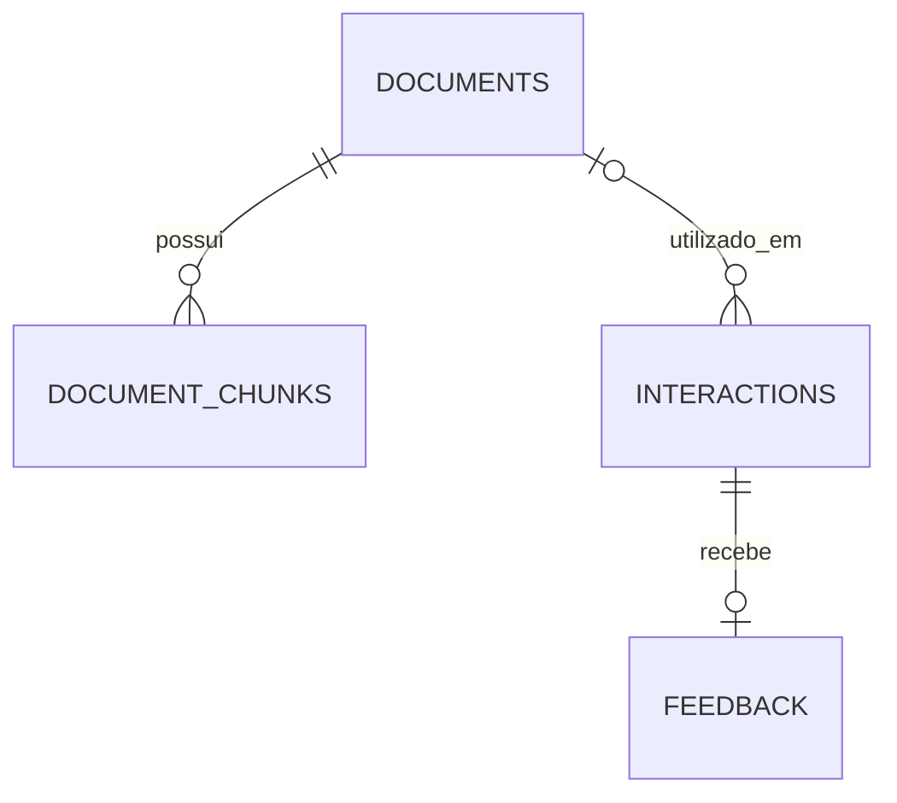

# Documento — guia da aplicação

## 1. Objetivo e experiência de uso

Documento é uma aplicação para consultar arquivos com apoio de inteligência artificial. O usuário envia um arquivo, faz uma pergunta, recebe uma resposta e pode avaliar sua utilidade. Os arquivos ficam em uma biblioteca; as consultas ficam em um histórico com resposta completa, fontes, modelo e tempo de processamento. A página de estatísticas resume o uso e os feedbacks do workspace.

Uma consulta é independente das anteriores: não existe memória automática de conversa. Para continuar um assunto, faça outra pergunta incluindo o contexto necessário. É possível reutilizar um documento salvo sem transferi-lo novamente do navegador.

Há dois modos:

| Modo | Comportamento | Quando usar |
| --- | --- | --- |
| Documento inteiro | Envia o conteúdo completo ao Gemini. Textos seguem em UTF-8; PDFs e imagens seguem como conteúdo binário em base64. | Resumos gerais, documentos pequenos e imagens. |
| Buscar trechos com fontes | Extrai texto, divide em trechos, gera embeddings, recupera os trechos mais próximos da pergunta e os envia ao Gemini. | Perguntas pontuais sobre textos e PDFs com texto extraível. |

O modo direto permanece como padrão para preservar o uso anterior. RAG não é necessariamente melhor para resumir um documento inteiro: uma busca que seleciona cinco trechos pode não cobrir todos os assuntos.

## 2. Funcionalidades

### Consulta e resposta

- Upload por seleção ou arrastar e soltar, limitado pelo backend e pela configuração exibida na interface.
- Formatos PDF, TXT, MD, CSV, JSON, PNG, JPEG e WEBP. Textos precisam ser UTF-8 e conter conteúdo.
- Perguntas de até 2.000 caracteres, sem aceitar apenas espaços.
- Seleção entre consulta direta e busca por trechos; controle para ignorar o cache.
- Resposta persistida antes de devolver sucesso, com identificador, data, modelo, fontes, modo, latência e tokens informados pelo provedor.
- Feedback positivo ou negativo, com comentário opcional. A avaliação só é aceita uma vez por consulta.
- Respostas e trechos são renderizados como texto. HTML gerado pelo modelo não é executado.

O documento é salvo antes da chamada ao provedor. Se o Gemini falhar, o arquivo continua disponível para uma nova tentativa, mas não é criada uma interação com resposta falsa ou incompleta. Se o banco falhar, a API responde 503; não comunica que a consulta foi salva quando isso não aconteceu.

### Biblioteca

A página Documentos lista arquivos do usuário, permite adicionar arquivos sem consultar, reutilizá-los e excluí-los. O backend detecta duplicatas pelo SHA-256 do conteúdo, dono e MIME. Um mesmo arquivo enviado duas vezes pelo mesmo usuário reutiliza o registro; o primeiro nome é mantido. Usuários diferentes possuem registros independentes.

Excluir um documento remove o arquivo e seus embeddings. As consultas anteriores permanecem no histórico, inclusive os trechos que já foram usados como fontes; sua associação com o documento passa a ser nula. Para remover também esses textos, exclua as consultas correspondentes. A interface explica essa diferença antes da exclusão.

### Histórico e feedback

A listagem é paginada, ordenada por data e UUID para desempate, e apresenta até 200 caracteres de cada resposta. A busca filtra o texto da pergunta. “Ver resposta completa” abre uma página com todo o conteúdo, fontes, avaliação, comentário e metadados.

O limite da listagem reduz o tráfego sem perder a resposta original. A consulta detalhada só carrega o texto completo quando o usuário o solicita. Excluir uma consulta também exclui o feedback correspondente.

### Estatísticas

O painel mostra total de interações, quantidade de avaliações, avaliações positivas/negativas, taxa positiva e latência média geral e das últimas 24 horas. A taxa positiva usa como denominador o total de avaliações, não o total de consultas. Sem avaliações, ela é zero. Cada envio concluído conta como interação, inclusive respostas vindas do cache.

## 3. Arquitetura e responsabilidades


| Camada | Arquivos | Por que existe |
| --- | --- | --- |
| Interface | `frontend/src/app/pages/` | Organiza as telas e seus estados de carregamento/erro. |
| Cliente HTTP | `frontend/src/app/core/api.ts` | Centraliza os contratos, URLs e envio da chave de acesso. |
| Feedback compartilhado | `frontend/src/app/shared/feedback.ts` | Reutiliza validação e comportamento na consulta, no histórico e nos detalhes. |
| Rotas | `app/api/routes/` | Valida o contrato HTTP e traduz resultados/erros em respostas consistentes. |
| Configuração e segurança | `app/core/` | Reúne banco, variáveis, identidade, limites e instrumentação. |
| Orquestração | `app/services/rag_service.py` | Coordena documento, cache, recuperação, geração e persistência. |
| Documentos | `app/services/document_service.py` | Deduplica arquivos e implementa extração, divisão, indexação e recuperação. |
| Provedor | `app/services/gemini_service.py` | Encapsula chamadas REST, timeout e validação das respostas do Gemini. |
| Modelos e schemas | `app/models/`, `app/schemas/` | Separa tabelas do banco dos contratos públicos da API. |
| Evolução do banco | `alembic/` | Aplica mudanças versionadas sem recriar o banco a cada inicialização. |
| Qualidade e operação | `tests/`, `evaluation/`, `monitoring/` | Verifica comportamento, compara respostas de referência e acompanha a aplicação. |

As dependências foram reduzidas às bibliotecas realmente usadas. Redis, Qdrant, LangChain e Streamlit não fazem parte deste fluxo. O PostgreSQL concentra documentos, embeddings e respostas; isso simplifica a instalação e mantém os dados relacionados sob o mesmo controle de acesso.

## 4. Como funciona o RAG

1. O texto é lido em UTF-8 ou extraído de cada página do PDF pelo pypdf. PDFs digitalizados sem texto, protegidos por senha ou inválidos não são indexados: o usuário recebe orientação para usar consulta direta.
2. O conteúdo é dividido em trechos de até 2.000 caracteres, com avanço de 1.800. A sobreposição de 200 caracteres reduz a perda de contexto nas fronteiras.
3. O Gemini gera embeddings de 768 dimensões em lotes de até 32 trechos. A operação usa `RETRIEVAL_DOCUMENT` para documentos e `RETRIEVAL_QUERY` para perguntas.
4. Os vetores e os textos são persistidos em `document_chunks`. O índice é identificado por modelo e versão da divisão, permitindo reconstrução quando essa configuração mudar.
5. A pergunta recebe um embedding. O sistema calcula similaridade por cosseno contra os trechos do documento selecionado e escolhe `RAG_TOP_K` resultados.
6. Os trechos são numerados e enviados ao Gemini com a pergunta. O prompt pede referências como `[1]` e que o modelo informe a ausência de evidência.
7. As fontes recuperadas são salvas junto à resposta e exibidas na interface, incluindo arquivo e página/trecho.

As fontes são evidências fornecidas ao modelo, não uma certificação automática de cada frase gerada. Ainda é necessário verificar informações importantes. A similaridade mede proximidade vetorial, não uma probabilidade de a resposta estar correta.

O índice usa vetores armazenados em JSON e busca exata na aplicação, restrita a um documento e limitada por `RAG_MAX_CHUNKS` (200 por padrão). Não requer extensão pgvector ou um serviço adicional. Essa decisão atende a uma biblioteca inicial com arquivos limitados; pesquisa simultânea em um acervo grande e índices aproximados são evoluções futuras. O limite de PDFs é de 500 páginas, além dos limites de bytes e trechos. A extração roda fora do loop assíncrono da API.

Referência do protocolo utilizado: [API oficial de embeddings do Gemini](https://ai.google.dev/api/embeddings). O modelo é configurável; sua disponibilidade e a cota precisam ser verificadas na conta utilizada.

## 5. Cache e consumo

O cache usa respostas já persistidas, sem um servidor Redis. Sua chave combina dono, documento, hash do conteúdo, pergunta, modo, modelo de geração, modelo de embeddings, quantidade de trechos e versões internas. Assim, configurações incompatíveis não compartilham respostas.

O tempo de validade padrão é de uma hora. A validade é contada a partir da geração original; acertos do cache não a renovam indefinidamente. `CACHE_TTL_SECONDS=0` desativa o cache. Na interface, desmarcar a reutilização força uma nova geração. Essa nova geração pode atender consultas seguintes.

Um acerto do cache ainda cria uma interação com UUID próprio e permite feedback independente. Os tokens dessa interação são zero porque ela não faz nova geração. `input_tokens` e `output_tokens` registram os contadores de prompt e resposta informados pelo Gemini. Ausência de metadados resulta em zero: isso não prova ausência de cobrança. Esses campos não incluem todos os possíveis tokens de raciocínio nem o consumo de embeddings e não são uma fatura ou estimativa monetária.

## 6. Banco e migrations



| Tabela | Conteúdo e decisões |
| --- | --- |
| `documents` | Dono, nome, hash, MIME, tamanho, bytes e data. Bytes ficam no PostgreSQL para evitar desencontro entre banco e arquivos locais. |
| `document_chunks` | Documento, posição, página/seção, texto, modelo/versão e vetor. Chave única evita duplicação do mesmo índice em requisições concorrentes. |
| `interactions` | Pergunta, resposta completa, fontes, dono, documento opcional, cache, modo, modelo, latência, tokens e data. |
| `feedback` | Uma avaliação por interação, nota `1` ou `-1`, comentário e data. Restrição no banco impede duplicatas e valores inválidos. |
| `alembic_version` | Revisão aplicada pelo Alembic. Não deve ser editada manualmente em operações normais. |

Há duas revisões:

- `ace48b94f7c9`: cria interações e feedback, como no projeto original. O default de data foi expresso com `sa.func.now()` para permitir testes SQLite, preservando o significado no PostgreSQL.
- `b72e9c41a603`: cria documentos e trechos e acrescenta os campos de isolamento, associação, cache, modo e tokens às interações.

Registros anteriores continuam no workspace `local`, com modo `direct`, tokens zero e sem documento associado. Uma chave configurada com identificador `local` permite acessar esse histórico depois de habilitar autenticação. Não é possível recuperar arquivos ou consultas antigas que nunca chegaram a ser salvos.

Para aplicar:

```powershell
.\.venv\Scripts\python.exe -m alembic upgrade head
.\.venv\Scripts\python.exe -m alembic current
.\.venv\Scripts\python.exe -m alembic check
```

`upgrade head` serve tanto para banco novo quanto para banco já versionado. Não use `revision --autogenerate` a cada inicialização.

Também há SQL exportado:

- `db/migrate_fresh.sql`: banco novo, sem as tabelas da aplicação.
- `db/migrate_existing.sql`: banco exatamente na revisão inicial `ace48b94f7c9`.

Prefira Alembic, que escolhe as revisões pendentes. Os scripts SQL não são idempotentes e não devem ser executados depois de `upgrade head`. Se as tabelas foram criadas manualmente e não existe `alembic_version`, compare o schema antes de qualquer `stamp`; marcar uma revisão não cria tabelas nem corrige divergências. Gere novamente os SQLs com `python scripts/export_migrations.py` quando alterar as migrations.

O downgrade da nova revisão remove documentos, trechos e colunas novas. Ele existe para ambientes de teste; em um banco com dados reais, planeje a restauração a partir de backup antes de usá-lo.

## 7. Configuração e execução local

Use Python 3.11, Node 22.20 e PostgreSQL 16. O arquivo `.env.example` lista as variáveis. Preserve seu `.env` existente e incorpore apenas as configurações necessárias.

```powershell
# Na raiz
python -m venv .venv
.\.venv\Scripts\python.exe -m pip install -r requirements-dev.txt
# Se ainda não houver um PostgreSQL local:
docker compose up -d postgres
.\.venv\Scripts\python.exe -m alembic upgrade head
.\.venv\Scripts\python.exe -m uvicorn app.main:app --reload

# Em outro terminal
cd frontend
npm.cmd ci
npm.cmd start
```

A interface abre em `http://localhost:4200`, e a documentação interativa da API fica em `http://127.0.0.1:8000/docs`. O proxy de desenvolvimento remove o prefixo `/api` antes de encaminhar ao backend.

Se o PostgreSQL do Windows já usa 5432, você pode utilizá-lo com a `DATABASE_URL` correta. Para um container separado, defina `POSTGRES_PORT=5433` e ajuste a URL da API executada no host para essa porta. Não remova volumes para resolver conflito de porta. Alterar `POSTGRES_USER` ou `POSTGRES_PASSWORD` no Compose não modifica automaticamente os usuários de um volume já inicializado.

| Variável | Efeito |
| --- | --- |
| `DATABASE_URL` | Conexão SQLAlchemy; nunca enviada ao navegador. |
| `GEMINI_API_KEY` | Credencial do provedor. `GOOGLE_API_KEY` é um alias; a primeira tem precedência. |
| `GEMINI_MODEL`, `EMBEDDING_MODEL` | Modelos de geração e embeddings. |
| `GEMINI_TIMEOUT_SECONDS` | Timeout de cada chamada HTTP ao provedor. Uma indexação pode exigir vários lotes. |
| `MAX_UPLOAD_BYTES` | Limite do arquivo, no máximo 10 MiB. |
| `RAG_TOP_K`, `RAG_MAX_CHUNKS` | Quantidade de fontes recuperadas e limite de indexação por documento. |
| `CACHE_TTL_SECONDS` | Validade da resposta original no cache. |
| `API_TOKENS` | Objeto JSON que associa identificadores estáveis a chaves de acesso. |
| `APP_ENV` | Apenas `development` permite acesso local sem chaves configuradas. |
| `RATE_LIMIT_PER_MINUTE` | Limite de consultas/uploads por usuário, por processo. |
| `CORS_ORIGINS` | Lista JSON de origens autorizadas no navegador. |

## 8. Autenticação e isolamento

O administrador configura chaves individuais em `API_TOKENS`. Exemplo de estrutura, substituindo os valores por chaves aleatórias reais:

```dotenv
APP_ENV=production
API_TOKENS={"ana":"SUBSTITUA_POR_CHAVE_ALEATORIA_LONGA","local":"OUTRA_CHAVE_ALEATORIA_LONGA"}
```

Gere chaves com `python -c "import secrets; print(secrets.token_urlsafe(32))"`. Elas devem ser distintas e ter pelo menos 24 caracteres. Mantenha o identificador do usuário ao trocar uma chave para preservar o acesso aos dados.

O navegador pede a chave de acesso da aplicação, que é diferente da chave do Gemini. A chave é armazenada no `sessionStorage` da aba e enviada apenas às URLs `/api/` como `Authorization: Bearer ...`. Sair apaga a chave e desmonta as telas autenticadas. O backend determina o dono pela credencial; nenhum campo enviado pelo navegador escolhe outro usuário. Documento, histórico, detalhe, exclusão, estatísticas, cache e feedback respeitam esse dono.

Em desenvolvimento sem `API_TOKENS`, todos os acessos compartilham `local`. Não use esse modo para um serviço público. Em outros ambientes, a ausência de chaves impede o acesso aos dados. A implantação pública precisa de HTTPS, credenciais próprias e backup. Não há cadastro autônomo, recuperação de senha, OAuth ou perfis administrativos na interface: o acesso é administrado por configuração.

## 9. Contratos HTTP

| Método e rota | Finalidade |
| --- | --- |
| `GET /config` | Configuração pública mínima: autenticação exigida e tamanho máximo. |
| `GET /health` | Liveness: confirma que o processo responde, sem acessar provedor ou banco. |
| `GET /ready` | Verifica acesso ao schema do banco e informa se existe chave Gemini configurada. Não testa a validade da chave nem consome cota. |
| `POST /ask` | Multipart: `question`, exatamente um de `file` ou `document_id`, `mode=direct\|rag`, `use_cache=true\|false`. |
| `POST /documents` | Upload multipart de `file`, sem chamada ao Gemini. |
| `GET /documents` | Biblioteca paginada por `limit` e `offset`. |
| `DELETE /documents/{id}` | Exclui documento e índice, mantendo consultas anteriores. |
| `GET /interactions` | Histórico com `limit`, `offset` e `search`. |
| `GET /interactions/{id}` | Resposta completa, fontes, metadados e feedback. |
| `DELETE /interactions/{id}` | Exclui consulta e feedback. |
| `POST /feedback` | JSON com `interaction_id`, `rating` e `comment` opcional. |
| `GET /stats` | Agregações do usuário. |
| `GET /metrics` | Instrumentação Prometheus interna. Bloqueada no proxy público do frontend. |

Listagens aceitam `limit` entre 1 e 100 e `offset` não negativo. A interface usa páginas de 20. Identificadores inválidos retornam 422; registros inexistentes ou de outro usuário retornam 404.

Erros principais: 401 para credencial ausente/inválida, 409 para feedback duplicado, 413 para tamanho/limite de indexação, 415 para formato, 422 para entrada inválida ou conteúdo bloqueado, 429 para limite local ou cota do provedor, 502 para falha de integração, 503 para indisponibilidade/configuração e 504 para timeout. A API não devolve o corpo bruto dos erros do provedor.

## 10. Docker, monitoramento e CI

Com Docker iniciado e `.env` configurado:

```powershell
docker compose --profile app up --build -d
# Interface: http://localhost:8080
docker compose --profile app --profile monitoring up --build -d
# Grafana: http://localhost:3000 ; Prometheus: http://localhost:9090
```

O serviço `migrate` aguarda o PostgreSQL, aplica as migrations e termina. A API inicia depois dessa etapa. O Nginx serve o build Angular, resolve as rotas do frontend e encaminha `/api/` à API. O corpo HTTP é limitado a 11 MiB para permitir um arquivo de 10 MiB e o overhead multipart. A API mantém sua própria validação. O proxy aceita até 900 segundos de espera para indexações; cada chamada ao Gemini possui seu próprio timeout.

As portas publicadas no Compose ficam vinculadas a `127.0.0.1`. Para disponibilizar externamente, configure um proxy com HTTPS e autenticação ativa. O banco usa volume nomeado; `docker compose down -v` remove dados e não faz parte da rotina de atualização. O container da API roda como usuário sem privilégios e com um worker.

Prometheus coleta requisições, erros, latência, acertos de cache, feedback e tokens de geração. Grafana recebe fonte de dados e dashboard automaticamente. As regras de alerta detectam API fora do ar, taxa de erro elevada e latência p95 alta. Elas ficam visíveis no Prometheus; envio de notificações externas exige configurar um Alertmanager ou contato no Grafana, que não está conectado a contas externas neste projeto.

O rate limiter é em memória e por processo: reinicia com a API e não coordena múltiplas réplicas. Antes de escalar horizontalmente, substitua-o por um limite compartilhado ou no gateway. A indexação é síncrona do ponto de vista da requisição; fila de trabalhos, armazenamento de objetos e busca aproximada são extensões para cargas maiores.

A pipeline `.github/workflows/ci.yml` verifica lint e formatação, testes Python, migrations em PostgreSQL, avaliação de respostas gravadas, formatação Angular, build e testes Playwright. Publicação/deploy automático não é executado pela pipeline.

## 11. Testes e avaliação

```powershell
.\.venv\Scripts\python.exe -m pytest -q
.\.venv\Scripts\python.exe -m ruff check app tests evaluation
.\.venv\Scripts\python.exe -m ruff format --check app tests evaluation
.\.venv\Scripts\python.exe -m evaluation.run
cd frontend
npm.cmd run format:check
npm.cmd run build
npm.cmd run test:e2e
```

Os testes automáticos simulam somente o transporte do Gemini e usam SQLite isolado quando testam a persistência. Exercitam o fluxo de consulta até estatísticas, cache/expiração, indexação/reutilização, falhas do provedor, validações, isolamento de usuários, exclusões e migrations com registros anteriores. Playwright cobre o navegador com respostas HTTP simuladas, sem depender de credenciais externas.

`evaluation/dataset.json` define perguntas, documentos e termos esperados. `evaluation.run` compara respostas e fontes e grava um relatório. O modo padrão usa exemplos gravados: valida o avaliador, não mede a qualidade atual do Gemini. Para avaliar o provedor real, use um workspace dedicado e a API em execução:

```powershell
$env:EVALUATION_API_TOKEN = 'CHAVE_DO_WORKSPACE_DE_AVALIACAO'
.\.venv\Scripts\python.exe -m evaluation.run --api-url http://127.0.0.1:8000
```

Esse modo envia os documentos sintéticos, consome cota e salva interações no workspace da chave. O relatório indica `live` ou `recorded`. A checagem por termos não detecta todas as alucinações, paráfrases corretas ou referências incorretas; amplie o conjunto e faça revisão humana para medir qualidade de forma confiável.

Também existe `python scripts/smoke_live.py --live`: usa o banco configurado e o Gemini real para validar consulta direta, cache, RAG, histórico, feedback e estatísticas com um workspace temporário. Ao terminar, remove somente os dados desse workspace de teste. Requer schema migrado, rede e cota disponíveis.

## 12. Limites atuais e decisões futuras

O projeto entrega o fluxo integrado e uma base de operação reproduzível. A disponibilidade do Gemini depende de chave, modelo e cota externos. Arquivos são guardados no banco, sem criptografia adicional feita pela aplicação; criptografia de disco, backups e políticas de retenção pertencem à implantação. PDFs/imagens no modo direto recebem validação básica de assinatura, não uma análise completa de segurança do documento.

Ainda não há OCR local, conversas com memória, pesquisa em vários documentos ao mesmo tempo, processamento em fila, cobrança financeira por usuário ou login corporativo. Essas capacidades exigem decisões de produto e de infraestrutura além do fluxo implementado. Os diretórios antigos com `.gitkeep` não representam funcionalidades ativas.
