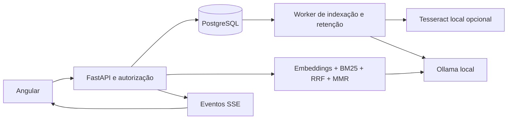

# Evolução do produto de documentos

## O que mudou

| Área | Implementação |
|---|---|
| Recuperação | RAG em até 20 documentos autorizados por pergunta; fontes com arquivo, página e trecho. |
| Busca híbrida | Similaridade por cosseno + BM25, combinadas por Reciprocal Rank Fusion (RRF). Filtros por categoria, tipo e data, além da seleção de documentos. |
| Re-ranking | MMR com penalização de redundância e limite de trechos por arquivo. Preserva evidências iguais de arquivos distintos para comparação. |
| OCR | Tesseract local, com Pillow e PDFium; fallback por página sem texto, limites de páginas, pixels e tempo. Opcional. |
| Processamento | Worker separado; fila persistida em PostgreSQL; reserva exclusiva de trabalho, recuperação de reservas expiradas e até três tentativas. |
| Conversas | Contexto com vários documentos; ramificações por turno, reexecução e mudança de documentos na ramificação. Streaming SSE nos modos direto e RAG. |
| Interface | Seleção múltipla, comparação, filtros da biblioteca, status com atualização periódica, fontes individuais, exportação Markdown e impressão/salvar PDF. |
| Administração | Perfis `admin`, `manager` (gestor) e `user`; equipes, concessões de leitura por usuário/equipe, revogação e cotas. |
| Privacidade | Máscara local de padrões sensíveis antes de embeddings/geração; auditoria; exclusão completa opcional e retenção configurável. |
| Observabilidade | Logs JSON, identificador por requisição, latência, erros, tokens, estimativa de custo, métricas por documento/equipe e validade das referências. |

## Arquitetura e decisões



O banco continua armazenando documentos, trechos, conversas e interações. Não foi adicionado Redis, banco vetorial ou provedor externo. Os vetores continuam em JSON, com busca exata limitada ao conjunto selecionado. A recuperação copia os trechos carregados para estruturas independentes da sessão, evitando consultas individuais provocadas por expiração de objetos após commits.

As fontes usam o `document_id` de cada trecho. `document_id` no nível da resposta permanece como documento principal para clientes antigos; `document_ids` informa o escopo efetivo. A tabela `interaction_documents` registra todos os documentos consultados e permite métricas e expurgo corretos no caso multi-documento.

Uma ramificação referencia a conversa anterior e um limite de turno. As mensagens herdadas não são copiadas, evitando duplicação nas métricas. São permitidos até 20 níveis; continuam valendo os limites de seis interações recentes e 12 mil caracteres de memória. O acesso aos documentos usados nessa memória é revalidado antes de enviá-la ao modelo.

O cache inclui documentos, hashes, algoritmo, filtros, parâmetros dos modelos, contexto e opções de privacidade/OCR. A autorização ocorre antes de consultá-lo. Uma concessão revogada não permite reutilizar uma resposta em uma nova consulta.

### Relevância e limites

- A busca textual normaliza maiúsculas e acentos e usa BM25 sobre os trechos selecionados.
- RRF combina posições nos rankings; o `score` retornado não é uma probabilidade.
- MMR reduz redundância, e o limite por documento evita que um arquivo longo ocupe todo o contexto.
- O prompt recebe apenas os trechos que cabem no orçamento de caracteres e pede citações e indicação de falta de evidência.
- `RAG_TOP_K` limita o total de fontes. Selecionar mais arquivos que esse limite não garante uma citação de cada arquivo.
- Este re-ranking é determinístico; não utiliza um modelo cross-encoder. Avaliação de fidelidade por humanos continua necessária.

## Instalação e atualização

Faça backup antes de atualizar uma instalação com dados. A API e o worker precisam da mesma versão de schema.

```powershell
.\.venv\Scripts\python.exe -m pip install -r requirements-dev.txt
.\.venv\Scripts\python.exe -m alembic upgrade head
.\.venv\Scripts\python.exe -m uvicorn app.main:app --host 127.0.0.1 --port 8000
```

Em outro terminal:

```powershell
.\.venv\Scripts\python.exe -m app.worker
```

Frontend:

```powershell
cd frontend
npm.cmd ci
npm.cmd start
```

O Compose inclui o worker no perfil `app` e espera as migrações terminarem:

```powershell
docker compose --profile app up --build -d
```

Novas revisões Alembic: `d94a1e63c825`, `e05b2f74d936`, `f16c3085ea47` e `a27d4196fb58`. Os scripts `db/migrate_*.sql` foram atualizados para instalações que usam SQL exportado. Não execute esses scripts e Alembic indiscriminadamente na mesma instalação; use o caminho de atualização correspondente à revisão atual.

### OCR

Instalação Python opcional:

```powershell
.\.venv\Scripts\python.exe -m pip install -r requirements-ocr.txt
```

Instale também Tesseract no sistema, inclua o executável no `PATH` e instale os idiomas escolhidos. Para Docker, `INSTALL_OCR=true` habilita a instalação dos pacotes na construção da imagem.

```dotenv
INSTALL_OCR=true
OCR_ENABLED=true
OCR_LANGUAGES=por+eng
OCR_MAX_PAGES=30
OCR_TIMEOUT_SECONDS=30
WORKER_TIMEOUT_SECONDS=600
```

O PDF é primeiro lido pelo pypdf; páginas sem texto recebem OCR quando habilitado. PDFs protegidos/inválidos continuam sendo rejeitados. A rasterização limita páginas a 20 megapixels; o OCR limita o tempo por imagem. PDFium é protegido por um mutex porque sua API não é segura para chamadas concorrentes em threads. OCR não reconhece automaticamente a estrutura de tabelas, manuscritos ou layouts complexos.

As APIs usadas seguem a documentação de [pypdfium2](https://pypdfium2.readthedocs.io/en/stable/python_api.html) e [pytesseract](https://github.com/madmaze/pytesseract).

### Identidades, equipes e limites

As chaves continuam em `API_TOKENS`; identificadores de usuários vêm dessas chaves, nunca de um campo `owner` enviado pelo cliente. Para habilitar o primeiro administrador, configure identificadores já presentes em `API_TOKENS`:

```dotenv
ADMIN_OWNERS=["administrador"]
REDACT_SENSITIVE_DATA=false
ESTIMATED_COST_PER_MILLION_TOKENS=0
```

O administrador usa a tela Administração para definir perfis, equipes e cotas. Identificadores em `ADMIN_OWNERS` preservam acesso administrativo mesmo se já existir uma política no banco. Gestores compartilham seus próprios documentos com usuários ou suas equipes. Concessões dão leitura e consulta; edição, exclusão, reprocessamento e compartilhamento permanecem com o dono. Administradores não recebem acesso implícito ao conteúdo privado de todos os usuários.

As cotas padrão são 1.000 consultas/dia UTC, 10 milhões de tokens/dia e 100 MiB de arquivos por usuário. Reservas de consultas/tokens são atômicas no PostgreSQL; uploads serializam a checagem de armazenamento pelo registro da política. O limite de armazenamento mede bytes dos arquivos originais, não o espaço total de índices e históricos.

A reserva de tokens é conservadora e pode exigir saldo maior que o consumo final. Ao concluir, ela é ajustada para os tokens de geração informados pelo Ollama. Falhas ou cancelamentos mantêm a reserva até a virada do dia, evitando que respostas interrompidas contornem o limite. Embeddings e recursos físicos do Ollama não têm medição monetária exata. O limitador por minuto existente ainda é por processo; use limitação no gateway ao escalar as réplicas.

## API

Os endpoints abaixo usam a autenticação existente. No frontend, recebem o prefixo `/api`; no backend são expostos diretamente.

| Endpoint | Uso |
|---|---|
| `POST /ask` | Mantém os campos antigos; aceita campos multipart repetidos `document_ids`, `hybrid`, `rerank`, `filters` JSON e `stream`. |
| `GET /documents` | `search`, `category`, `mime_type`, `created_from`, `created_to`, `limit`, `offset`. Datas sem fuso são interpretadas em UTC. |
| `GET /interactions` | Busca por pergunta e filtros `mode`, `document_id`, `created_from`, `created_to`; inclui documentos secundários do RAG. |
| `PATCH /documents/{id}` | Atualiza `category`; somente o dono. |
| `POST /documents/{id}/retry` | Reenfileira um processamento que falhou. |
| `POST /conversations/{id}/branches` | JSON com `turn`, `title` opcional e `document_ids` opcionais. |
| `GET /me` | Identidade, perfil, equipes e cotas efetivas. |
| `GET /admin/users`, `PUT /admin/users/{id}` | Administração de políticas de usuários configurados. |
| `GET/POST /documents/{id}/grants` | Lista/concede leitura por `kind: user ou team` e `recipient`. |
| `DELETE /documents/{id}/grants/{grant_id}` | Revoga a concessão. |
| `GET /audit` | Atividades próprias; administradores veem todas. Paginação por `offset`. |
| `GET /analytics` | Métricas próprias; `team` exige gestor/admin integrante da equipe. |
| `DELETE /documents/{id}?purge_history=true` | Remove também interações vinculadas ao arquivo, inclusive quando consultado por outro usuário. |

Escolha exatamente uma origem: arquivo, `document_id`, `document_ids` ou `conversation_id`. A seleção por lista exige `mode=rag`. Todos os documentos explicitamente enviados são autorizados antes de aplicar os filtros. Uma combinação sem documentos correspondentes retorna 422.

Exemplo de filtros multipart:

```json
{"category":"financeiro","mime_type":"application/pdf","created_from":"2026-01-01T00:00:00Z"}
```

### Streaming

`stream=true` retorna `text/event-stream`, com eventos `token` (`text`), `done` (resposta persistida completa) ou `error` (`status`, `detail`). Há comentários de heartbeat a cada 15 segundos sem dados. O cliente deve aguardar `done`; HTTP 200 sozinho não significa que a geração terminou. Uma resposta incompleta do provedor não é salva como interação concluída.

O streaming usa os deltas reais do Ollama, não a divisão de uma resposta já pronta. Cache produz `done` diretamente. O modo multiagente continua retornando sua resposta final sem streaming. O frontend cancela a conexão ao sair da tela; uma resposta já concluída pode ter sido persistida antes dessa desconexão.

O transporte usa `stream` e `stream_options.include_usage` do endpoint de chat compatível, documentados pelo [Ollama](https://docs.ollama.com/api/openai-compatibility).

As sugestões de continuação são modelos de perguntas determinísticos, sem outra chamada ao provedor. PDF é exportado pelo diálogo de impressão do navegador; Markdown é baixado como arquivo.

## Processamento, retenção e privacidade

O upload grava o arquivo e retorna seu estado, sem executar embeddings. O worker usa `FOR UPDATE SKIP LOCKED` e um token de reserva. Após timeout/interrupção, outro worker pode reassumir o trabalho. Falhas temporárias recebem espera progressiva; falhas de formato terminam sem repetição automática. Após três tentativas, o usuário pode reenfileirar pelo painel.

O progresso indica marcos (`0` na fila, `10` em processamento, `100` pronto), não uma previsão linear de tempo. Sem worker, o RAG ainda indexa sob demanda para preservar o fluxo antigo; a primeira pergunta pode demorar. O worker deve estar ativo para antecipar essa etapa.

Retenção fica desativada por padrão. Ao salvar `retention_days`, o worker aplica a regra em lotes de até 100 registros por tipo/usuário, entre trabalhos, com intervalo mínimo de um minuto. Ela remove arquivos, interações relacionadas e conversas vencidas. Para inspecionar políticas sem executar exclusões, use a rotina de prévia com o worker parado:

```powershell
.\.venv\Scripts\python.exe -m scripts.retention
# Aplicar manualmente as regras já configuradas:
.\.venv\Scripts\python.exe -m scripts.retention --apply
```

A exclusão comum mantém o histórico, como antes. `purge_history=true` e a retenção expurgam interações vinculadas, incluindo cópias no cache e feedback associado. A trilha de auditoria preserva identificadores e ações, sem o texto dos arquivos. Backups externos precisam de política de retenção própria.

Com `REDACT_SENSITIVE_DATA=true`, padrões de e-mail, CPF, CNPJ, telefone e credenciais são substituídos antes de embeddings e geração, incluindo o histórico enviado ao modelo. Imagens exigem extração OCR nesse modo. A máscara não é um classificador geral de dados pessoais e não identifica todos os nomes, endereços ou segredos. Arquivos e históricos armazenados não são anonimizados por essa opção. Revogar uma concessão bloqueia novas leituras/consultas ao arquivo; respostas previamente recebidas permanecem no histórico até seu expurgo.

## Métricas e operação

- Logs em JSON não incluem corpo de upload, pergunta, resposta ou chave. Cada resposta recebe `X-Request-ID`; o log HTTP usa o modelo da rota e o tempo até os headers.
- O histograma de consultas mede o processamento completo, inclusive streaming.
- `/analytics` apresenta tokens informados pelo provedor, falhas nas últimas 24 horas, uso por documento e p95 sobre até 1.000 interações recentes.
- Validade de citações verifica se referências numéricas apontam para fontes existentes. Não mede se a fonte realmente sustenta cada afirmação.
- O custo usa `ESTIMATED_COST_PER_MILLION_TOKENS`; zero é o padrão para Ollama local. Não representa faturamento nem custo medido de hardware.
- `/metrics` exige autenticação quando a aplicação exige chaves. Configure a credencial de scraping do Prometheus no ambiente autenticado. O Nginx continua bloqueando `/api/metrics` para o navegador.
- Os alertas existentes de indisponibilidade, erro e latência continuam aplicáveis; o novo registro de falhas e a duração completa do streaming alimentam essas medições.

## Verificação e limites de entrega

```powershell
.\.venv\Scripts\python.exe -m pytest -q
.\.venv\Scripts\python.exe -m ruff check app tests evaluation
.\.venv\Scripts\python.exe -m ruff format --check app tests evaluation
.\.venv\Scripts\python.exe -m evaluation.run
cd frontend
npm.cmd run format:check
npm.cmd run build
npm.cmd run test:e2e -- --workers=2
```

Os testes cobrem cache por escopo, isolamento, filtros, orçamento de contexto, diversidade, OCR/fallback, reservas do worker, retries, branches, streaming truncado, máscaras, quotas, concessões, retenção e métricas. Playwright cobre o fluxo antigo e seleção múltipla, links de fontes, streaming, download Markdown e comparação.

`tests/test_postgres_concurrency.py` exige `POSTGRES_TEST_URL` e cria um schema temporário, removido ao terminar. A CI configura essa variável e valida concorrência de uploads, cotas e workers em PostgreSQL. `tests/test_ocr_native.py` exige Tesseract e dependências opcionais; há um job próprio de OCR na CI. Sem essas condições, os testes são explicitamente ignorados, não contabilizados como integração validada.

Nesta execução local, as chamadas ao Ollama nos testes são simuladas, o Docker não respondeu e Tesseract não estava disponível. Ainda é necessário executar a CI e validar inferência/OCR reais na instalação de destino. Não foi aplicada migração ao banco de dados pessoal nem iniciada uma implantação.

### Próximas evoluções recomendadas

1. Medir recuperação e latência com o acervo real antes de aumentar os limites; considerar índice PostgreSQL/pgvector para grandes volumes.
2. Criar um conjunto de avaliação representativo e comparar o re-ranking atual com um cross-encoder local.
3. Evoluir OCR para estrutura de tabelas/layout, progresso por página e tratamento de PDFs parcialmente ilegíveis.
4. Complementar autenticação por chave com identidade corporativa quando necessária; equipes atuais são agrupamentos de acesso, não um sistema separado de organizações/workspaces.
5. Ajustar reservas de tokens, armazenamento, retenção de auditoria/backups e alertas segundo o uso observado.
